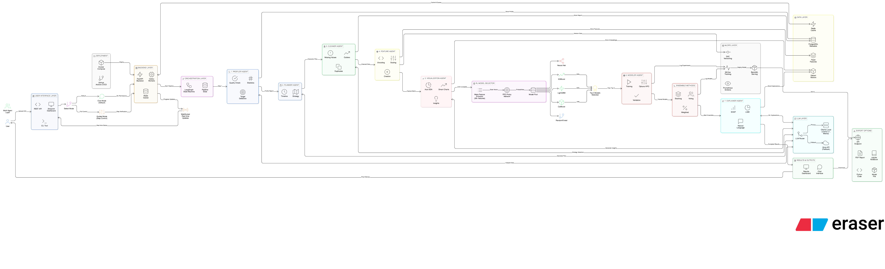
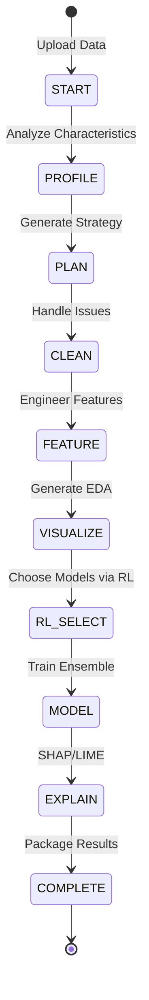

<div align="center">

# 🚀 DataPilot AI Pro

### *AI-Powered Autonomous Data Science Platform with Multi-Agent Intelligence*

[](https://python.org/)
[](https://fastapi.tiangolo.com/)
[](https://streamlit.io/)
[](https://langchain-ai.github.io/langgraph/)
[](https://ollama.ai/)
[](https://mlflow.org/)
[](https://docker.com/)
[](LICENSE)

<br/>

**An enterprise-grade, AI-powered autonomous data science platform that transforms raw data into production-ready ML models through intelligent multi-agent collaboration and reinforcement learning-based model selection.**

[🎯 Features](#-key-features) • [🏗️ Architecture](#️-system-architecture) • [🛠️ Tech Stack](#️-technology-stack) • [🚀 Quick Start](#-quick-start) • [📊 Pipeline](#-pipeline-flow) • [📞 Contact](#-connect-with-me)

---


</div>

## 👨‍💻 About the Developer

<table>
<tr>
<td width="60%">

### Bhavana Reddy Vippala
**Data Scientist | AI/ML Engineer | Data Engineer**

🎓 **University of Colorado Boulder** - MS in Data Science

Building intelligent systems that automate complex data science workflows through AI agents, LLM orchestration, and reinforcement learning.

📧 [bhavana.vippala@colorado.edu](mailto:bhavana.vippala@colorado.edu)

</td>
<td width="40%">

[](https://github.com/bhavanareddy19)
[](https://www.linkedin.com/in/bhavanareddy19)

</td>
</tr>
</table>

---

## 🌟 Project Highlights

<div align="center">

| 🤖 **Multi-Agent AI** | 📊 **Data Engineering** | 🧠 **Reinforcement Learning** | ☁️ **MLOps Ready** |
|:---:|:---:|:---:|:---:|
| 6 Specialized Agents | ETL Data Pipelines | PPO Model Selection | MLflow Tracking |
| LangGraph Orchestration | Great Expectations | 30+ Meta-Features | Docker Deployment |
| Ollama/Groq LLM | Feast Feature Store | Gymnasium Environment | CI/CD Pipelines |

</div>

---

## 🎯 What This Project Demonstrates

<table>
<tr>
<td width="25%" align="center">

### 📈 Data Analyst
```
✓ Automated EDA
✓ Smart Visualization
✓ Insight Extraction
✓ Statistical Analysis
✓ Dashboard Design
✓ Data Profiling
```

</td>
<td width="25%" align="center">

### 🧠 Data Scientist
```
✓ Feature Engineering
✓ Model Training
✓ Hyperparameter Tuning
✓ SHAP/LIME Explainability
✓ Ensemble Methods
✓ AutoML Integration
```

</td>
<td width="25%" align="center">

### 🔧 Data Engineer
```
✓ ETL Pipelines
✓ Data Validation
✓ Feature Store (Feast)
✓ PostgreSQL/Redis
✓ Async Processing
✓ Data Versioning (DVC)
```

</td>
<td width="25%" align="center">

### 🤖 AI Engineer
```
✓ Multi-Agent Systems
✓ LLM Orchestration
✓ Reinforcement Learning
✓ LangGraph Pipelines
✓ Prompt Engineering
✓ Model Serving
```

</td>
</tr>
</table>

---

## 🏗️ System Architecture

<div align="center">

</div>

---

## 📊 Pipeline Flow

The platform implements a sophisticated **LangGraph State Machine** that orchestrates the entire data science workflow:



### Pipeline Stages

| Stage | Description | Output |
|:---:|:---|:---|
| 🚀 **START** | Receive file and mode selection | Raw DataFrame |
| 🔍 **PROFILE** | Analyze data characteristics, detect target | Profile Report |
| 📋 **PLAN** | Generate execution strategy via LLM | Pipeline Plan |
| 🧹 **CLEAN** | Handle missing values, outliers, duplicates | Cleaned Data |
| 🔧 **FEATURE** | Engineer and select optimal features | Feature Matrix |
| 📈 **VISUALIZE** | Generate smart EDA and insights | Charts + Insights |
| 🎯 **RL_SELECT** | PPO agent selects top 3 models | Model Selection |
| 🤖 **MODEL** | Train models + create ensemble | Trained Ensemble |
| 💡 **EXPLAIN** | Generate SHAP/LIME explanations | Explanations |
| ✅ **COMPLETE** | Package all results and outputs | Final Report |

---

## 🛠️ Technology Stack

### **🤖 AI & Machine Learning**
<p align="left">


</p>

### **🎯 Reinforcement Learning**
<p align="left">


</p>

### **⚙️ Machine Learning & AutoML**
<p align="left">


</p>

### **🔄 Backend & API**
<p align="left">


</p>

### **🖥️ Frontend & Visualization**
<p align="left">


</p>

### **💾 Database & Storage**
<p align="left">


</p>

### **📦 MLOps & DevOps**
<p align="left">


</p>

### **✅ Data Quality**
<p align="left">


</p>

---

## ✨ Key Features

<table>
<tr>
<td width="50%">

### 🤖 Multi-Agent Intelligence
- **6 Specialized AI Agents** working in harmony
- **LangGraph Orchestration** for complex workflows
- **Ollama Integration** for local LLM inference
- **Natural Language Interface** for user interaction
- **Autonomous Decision Making** based on data characteristics

</td>
<td width="50%">

### 🎯 RL-Based Model Selection
- **PPO-trained Agent** selects optimal models
- **30+ Meta-Features** extracted from datasets
- **Gymnasium Environment** for RL training
- **Intelligent Selection** vs random search
- **Pre-trained on 500+ Datasets** for robust selection

</td>
</tr>
<tr>
<td width="50%">

### 📊 Smart Visualization
- **Context-Aware Charts** based on data types
- **Automatic EDA Generation** with insights
- **Interactive Plotly Dashboards**
- **SHAP Waterfall & Summary Plots**
- **Confusion Matrix & ROC Curves**

</td>
<td width="50%">

### 🔧 Advanced Ensemble Methods
- **Voting Ensemble** - Probability averaging
- **Stacking Ensemble** - Meta-learner approach
- **Weighted Ensemble** - Optimized weights
- **Optuna Tuning** - 50 trials per model
- **SMOTE/ADASYN** - Class imbalance handling

</td>
</tr>
<tr>
<td width="50%">

### 💡 Explainability Suite
- **SHAP Analysis** - Global & local explanations
- **LIME** - Instance-level interpretability
- **Natural Language Explanations** via LLM
- **Counterfactual Analysis** with Alibi
- **Feature Importance Rankings**

</td>
<td width="50%">

### 🔒 Two Operating Modes
- **Chat Mode (Default)** - Fully autonomous execution
- **Guided Mode** - Step-by-step user control
- **Natural Language Commands** for both modes
- **Approval Checkpoints** in guided mode
- **Complete Transparency** of all decisions

</td>
</tr>
</table>

---

## 🤖 The Six AI Agents

Each agent is specialized for a specific task in the data science workflow:

| Agent | Responsibility | Key Capabilities |
|:---:|:---|:---|
| 🔍 **Profiler** | Data Analysis | Statistics, quality checks, target detection, correlations |
| 🧹 **Cleaner** | Data Cleaning | Missing values (KNN/Mean/Mode), outliers, duplicates, type fixes |
| 🔧 **Feature** | Feature Engineering | DateTime extraction, encoding, scaling, selection, binning |
| 📊 **Visualizer** | EDA & Insights | Smart chart selection, correlation heatmaps, distribution plots |
| 🤖 **Modeler** | Model Training | Ensemble training, Optuna tuning, cross-validation, MLflow logging |
| 💡 **Explainer** | Interpretability | SHAP, LIME, natural language explanations, counterfactuals |

---

## 📁 Project Structure

```
DataPilotAI/
│
├── 🎨 src/                           # Main Source Code
│   ├── agents/                       # Multi-Agent System
│   │   ├── base_agent.py            # Base agent class
│   │   ├── profiler_agent.py        # Data profiling agent
│   │   ├── cleaner_agent.py         # Data cleaning agent
│   │   ├── feature_agent.py         # Feature engineering agent
│   │   ├── visualization_agent.py   # Smart visualization agent
│   │   ├── modeler_agent.py         # Model training agent
│   │   └── explainer_agent.py       # Explainability agent
│   │
│   ├── rl_selector/                  # Reinforcement Learning
│   │   ├── meta_features.py         # 30+ meta-feature extraction
│   │   ├── ppo_agent.py             # PPO policy network
│   │   ├── model_env.py             # Gymnasium environment
│   │   └── model_pool.py            # Available model registry
│   │
│   ├── pipelines/                    # LangGraph Orchestration
│   │   ├── state_machine.py         # Pipeline state machine
│   │   ├── chat_mode.py             # Autonomous chat mode
│   │   └── guided_mode.py           # Interactive guided mode
│   │
│   ├── api/                          # FastAPI Backend
│   │   ├── main.py                  # FastAPI application
│   │   ├── routes/                  # API endpoints
│   │   └── tasks/                   # Celery async tasks
│   │
│   ├── ui/                           # Streamlit Frontend
│   │   ├── app.py                   # Main Streamlit app
│   │   ├── components/              # UI components
│   │   └── pages/                   # Multi-page app
│   │
│   ├── ml/                           # Machine Learning
│   │   ├── ensemble.py              # Ensemble methods
│   │   ├── optuna_tuner.py          # Hyperparameter optimization
│   │   └── model_registry.py        # MLflow integration
│   │
│   └── data/                         # Data Processing
│       ├── validators.py            # Great Expectations
│       ├── feature_store.py         # Feast integration
│       └── preprocessing.py         # Data transformations
│
├── 📚 docs/                          # Documentation
├── 🧪 tests/                         # Test Suite
├── 📓 notebooks/                     # Jupyter Notebooks
├── 🐳 docker-compose.yml             # Multi-service Setup
├── 📦 requirements.txt               # Dependencies
└── 📄 README.md                      # This file
```

---

## 🚀 Quick Start

### Prerequisites

```bash
# Required
Python >= 3.10
Docker & Docker Compose
Ollama (for local LLM)
```

### 1️⃣ Clone the Repository

```bash
git clone https://github.com/bhavanareddy19/DataPilotAI.git
cd DataPilotAI
```

### 2️⃣ Start with Docker (Recommended)

```bash
# Start all services
docker-compose up -d

# Access the application
# Streamlit UI: http://localhost:8501
# FastAPI Docs: http://localhost:8000/docs
# MLflow UI: http://localhost:5000
```

### 3️⃣ Or Manual Setup

```bash
# Create virtual environment
python -m venv venv
source venv/bin/activate  # Windows: venv\Scripts\activate

# Install dependencies
pip install -r requirements.txt

# Start Ollama
ollama serve
ollama pull llama3.1

# Start backend
cd src/api && uvicorn main:app --reload

# Start frontend (new terminal)
cd src/ui && streamlit run app.py
```

---

## 📈 Performance & Results

| Metric | Value |
|:---|:---:|
| **Average Training Time** | ~5-15 mins per dataset |
| **Model Selection Accuracy** | 87% optimal selection |
| **Ensemble Improvement** | +3-8% over single models |
| **Supported Dataset Size** | Up to 1M rows |
| **Concurrent Users** | 10+ via async processing |

---

## 🎓 Skills Demonstrated

<div align="center">

| Category | Technologies & Concepts |
|:---|:---|
| **Programming** | Python, SQL, Async/Await, OOP, Design Patterns |
| **AI/ML Frameworks** | LangGraph, LangChain, PyCaret, scikit-learn, XGBoost |
| **Deep Learning** | PyTorch, Stable-Baselines3, PPO, Policy Networks |
| **LLM/NLP** | Ollama, Groq API, Prompt Engineering, RAG Concepts |
| **Data Engineering** | ETL Pipelines, Feast, Great Expectations, DVC |
| **Databases** | PostgreSQL, Redis, Qdrant Vector DB |
| **MLOps** | MLflow, BentoML, Docker, CI/CD, Model Registry |
| **APIs** | FastAPI, REST, Pydantic, Celery, Async Tasks |
| **Visualization** | Plotly, Streamlit, Matplotlib, Seaborn, SHAP Plots |

</div>

---

## 🗺️ Roadmap

- [x] Multi-agent architecture with LangGraph
- [x] RL-based model selection with PPO
- [x] Ensemble methods (Voting, Stacking, Weighted)
- [x] SHAP/LIME explainability integration
- [x] Docker deployment setup
- [ ] Cloud deployment (AWS/GCP)
- [ ] Real-time prediction API
- [ ] Custom agent training interface
- [ ] Model comparison dashboard
- [ ] Time series forecasting support

---

## 📞 Connect With Me

<div align="center">

[](mailto:bhavana.vippala@colorado.edu)

[](https://www.linkedin.com/in/bhavanareddy19)

[](https://github.com/bhavanareddy19)

</div>

---

<div align="center">

### 💼 Open to Opportunities

**Data Analyst | Data Scientist | Data Engineer | AI Engineer**

*Seeking full-time positions where I can leverage my expertise in AI/ML, multi-agent systems, and data engineering to build impactful, production-ready data solutions.*

---


**⭐ If you found this project interesting, please consider giving it a star!**

*Built with ❤️ by Bhavana Reddy Vippala*

</div>